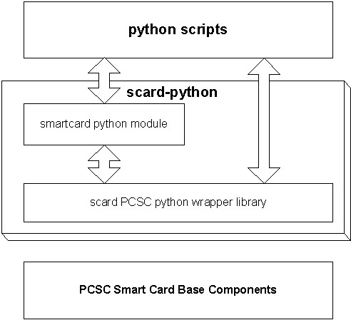

pyscard - python for smart cards
################################

`pyscard - python smart card library -
<https://sourceforge.net/projects/pyscard/>`_ is a python module adding
smart cards support to `python <http://www.python.org/>`_.

`download <https://sourceforge.net/projects/pyscard/files/pyscard/>`_
pyscard from sourceforge.net.

Report bugs, patches and feature requests using the `sourceforge pyscard
bug tracking system <https://sourceforge.net/p/pyscard/_list/tickets>`_.

Pyscard consists of:

* `smartcard.scard
  <http://pyscard.sourceforge.net/epydoc/smartcard.scard.scard-module.html>`_,
  an extension module wrapping the WinSCard API (smart card base
  components) also known as PC/SC, and

* `smartcard <http://pyscard.sourceforge.net/epydoc/index.html>`_, a
  higher level python framework built on top of the raw PC/SC API.

Documentation
*************

    :ref:`pyscard_user_guide`

    `smartcard reference (python smart card library)
    <http://pyscard.sourceforge.net/epydoc/index.html>`_

    `scard reference (python PCSC wrapper)
    <http://pyscard.sourceforge.net/epydoc/smartcard.scard.scard-module.html>`_,
    the python wrapper around PCSC

Samples
*******

    High level API samples: See :ref:`framework_samples`

    Low level API samples: See :ref:`wrapper_samples`

Index
*****

Contents:

.. toctree::
   :maxdepth: 4

   user-guide
   pyscard-framework
   pyscard-wrapper
   license

Indices and tables
==================

* :ref:`genindex`
* :ref:`modindex`
* :ref:`search`

